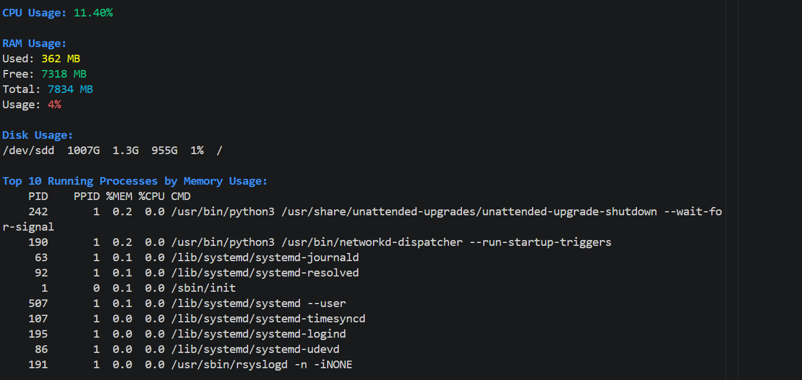

#  Linux System Monitor

A lightweight Bash-based system monitoring tool for Linux environments.

This project provides real-time insights into system performance directly from the terminal, making it useful for quick diagnostics, learning Linux internals, and demonstrating DevOps scripting skills.

---

## Screenshot



---

## Features

- Real-time CPU usage monitoring
- RAM usage breakdown (used, free, total, percentage)
- Clean disk usage display (filtered for real devices)
- Top 10 processes sorted by memory usage
- Colorized and structured terminal output

---

## Technologies Used

- Bash scripting
- Linux system tools:
  - `top`
  - `free`
  - `df`
  - `ps`
  - `awk`
  - `grep`
  - `column`

---

## Project Structure

```bash
linux-system-monitor/
├── linux_system_monitor.sh
├── README.md
└── assets/
    └── screenshot.png
```

## How to Run
1. Clone the repository
git clone https://github.com/JohannesGuzman/linux-system-monitor.git
cd linux-system-monitor
2. Make the script executable
chmod +x linux_system_monitor.sh
3. Run the script
./linux_system_monitor.sh

## What This Project Demonstrates
Bash scripting fundamentals
Interaction with Linux system resources
Parsing and processing command-line output
Structuring modular scripts
Building simple DevOps-style tools

## Possible Improvements
Interactive CLI options (flags like --cpu, --ram)
Real-time charts or usage bars
Logging system metrics to a file
Alerts for high resource usage
Integration with system monitoring tools

## Author
Johannes Guzman